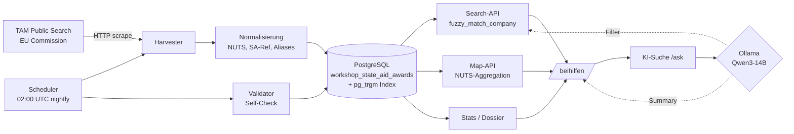

# EU-Beihilfe-Transparenzregister — Demo-Skript (3 Minuten)

> Stand: 2026-05-08 · Modul `/beihilfen` der Workshop-Plattform
> Datenbestand: **171.257 Awards** aus DE und AT seit 2016

## Was es kann

Ein Live-System, das oeffentliche EU-State-Aid-Daten lokal harvestet,
normalisiert, durchsuchbar macht und mit Beneficiaries + Sanktionen kreuzt.

Im Vergleich zum offiziellen TAM-Portal:

- **Eine Suche, alle Koerperschaften** — keine Vorab-Auswahl von Bund / Land /
  Foerderbank noetig.
- **Volltext-Fuzzy** — `Fraunhofer Gesellschaft` findet die `Fraunhofer-Gesellschaft
  zur Foerderung der angewandten Forschung e.V.`
- **NUTS-Filter mit Karten-Klick** — Bayern-Polygon klicken, Tabelle filtert auf
  alle Awards mit `nuts_code LIKE 'DE2%'`.
- **KI-Suche** — natuerlichsprachige Frage, LLM extrahiert Filter, SQL liefert
  Daten, LLM fasst zusammen.
- **Cross-Register-Dossier** — paralleler Lookup in State-Aid +
  Beneficiaries-Verzeichnis + Sanktionslisten.
- **Self-Check** — naechtlicher Validator prueft Datenqualitaet automatisch.

## Demo-Pfad

### 1. Suche per Unternehmen (45 Sek)

- `/beihilfen` → Tab **Treffer**
- Eingabe: `Fraunhofer-Gesellschaft` → ~22 Treffer aus Bund + Laendern zusammen
- Erkennen: `Score 100 / Confidence "exact"` rechts, normalisierter Vergleich
  links unter dem Namen
- Anders als TAM: keine Vorab-Auswahl der Bewilligungsstelle noetig

### 2. NUTS-Filter mit Karte (45 Sek)

- Tab **Karte** → Klick auf Bayern-Polygon
- Ergebnis: filtert Tabelle automatisch auf `nuts_code LIKE 'DE2%'` —
  also DE2 (Land) + DE21 (Oberbayern) + DE212 (Stadtkreis Muenchen) usw.
- Zeigt: **5.559 Bayern-Awards** inkl. NUTS-3-Sub-Treffer

### 3. KI-Suche (60 Sek)

- Tab **KI-Suche**
- Eingabe: „Welche Top-Behoerden haben 2020 in NRW Beihilfen vergeben?"
- Beobachten: LLM erkennt Filter (`country_code=DE`, `nuts_code=DEA`,
  `since=2020-01-01`, `until=2020-12-31`), SQL liefert echte Daten,
  LLM fasst zusammen — keine Halluzinationen
- Pflichthinweis im UI: „Filter vom LLM, Treffer und Betraege aus der DB."

### 4. Cross-Register-Dossier (45 Sek)

- Tab **Dossier**
- Eingabe: beliebiger Beneficiary-Name (z.B. `Robert Bosch GmbH`)
- Sieh: parallele Treffer aus
  - State-Aid-Register (mit Summen-Aggregation)
  - Beneficiaries-Verzeichnis (Transparenzlisten Hessen / ESF / JTF)
  - Sanktionslisten-Check (FSF-CSV)

## Cross-Register-Pruefbericht

Der **Cross-Register-Pruefbericht** ist ein mehrseitiges PDF, das ein Pruefer
auf Knopfdruck fuer einen Unternehmensnamen erzeugt. Er aggregiert die Daten
aus allen drei Registern (EU-State-Aid + Beguenstigtenverzeichnis + Sanktionen)
und stellt sie **rein faktisch** dar — **keine Bewertung, kein Risiko-Score,
keine Empfehlung**. Der Pruefer urteilt selbst.

### Was der Bericht enthaelt

1. **Deckblatt** — Suchbegriff, Aktenzeichen, Auftraggeber, Pruefer-Name,
   Erstellungsdatum.
2. **Zusammenfassung (Page 2)** — quantitative Treffer pro Register
   (Anzahl + Summe in EUR, sofern verfuegbar) und Aufteilung der Querbezuege.
3. **EU-State-Aid-Sektion** — Treffer-Liste (Top 50 nach Foerderbetrag),
   Verteilung nach Jahr, Top-10 Bewilligungsstellen, NUTS-1-Verteilung,
   Top-10 Beihilfe-Instrumente, verlinkte SA-Referenzen + KOM-Faelle.
4. **Beguenstigtenverzeichnis-Sektion** — Treffer-Liste mit Aktenzeichen,
   Vorhaben, Fonds (EFRE/ESF/JTF), Bundesland und Kosten.
5. **Sanktionslisten-Check** — faktisch: Treffer ja/nein, Liste mit Score,
   Konfidenz, Aliase und Land. Ein Treffer ist **kein** Beleg fuer
   Sanktionsbetroffenheit — der Pruefer entscheidet.
6. **Querbezuege (neutrale Beobachtungen)** — Datensaetze, die ueber
   gemeinsame Felder miteinander in Verbindung stehen:
   - `name_match_state_aid_beneficiary` — gleicher (normalisierter) Name
     in State-Aid + Beguenstigtenverzeichnis
   - `identifier_match` — gleiche HRB/Steuer-Nr. in beiden Registern
   - `sa_reference_kom_case_linked` — SA-Referenz mit verlinktem KOM-Fall
   - `duplicate_award_within_year` — 5+ Awards desselben Beguenstigten
     in 12-Monats-Fenster
7. **Anhang** — Datenstand pro Quelle (letzter Harvest, Record-Count) +
   Pflichthinweis (siehe unten).

Jede Beobachtung enthaelt **Evidenz** (welches Feld in welchem Datensatz),
aber **keine Severity-Klassifikation**.

### Pflichthinweis-Wortlaut (im Anhang jedes Berichts)

> Quelle: EU Transparency Aid Module (TAM) und nationale Beihilfe-Register,
> lokale Beguenstigtenverzeichnis-Uploads (Transparenzlisten der Laender)
> sowie OpenSanctions FSF-CSV (EU Konsolidierte Finanzsanktionsliste).
> State-Aid-Datenstand: {Datum}. Sanktionslisten-Datenstand: {Datum}.
> Vollstaendigkeit kann nicht garantiert werden. Die Pruefer-Bewertung
> obliegt dem Anwender — dieser Bericht liefert ausschliesslich aufbereitete
> Fakten ohne Bewertung und ohne Empfehlung.

### API-Endpoints

| Endpoint | Methode | Auth | Zweck |
|---|---|---|---|
| `/api/state-aid/audit-report` | GET | oeffentlich | JSON fuer UI-Live-Vorschau |
| `/api/state-aid/audit-report/pdf` | POST | oeffentlich | PDF-Stream + Audit-Log-Eintrag |
| `/api/state-aid/audit-report/log` | GET | Admin | Liste der erzeugten Berichte |

### Beispiel-Demo

```bash
# JSON-Vorschau (UI nutzt diesen Endpoint)
curl -s 'http://localhost:8006/api/state-aid/audit-report?q=Trumpf&country_code=DE' | jq '.state_aid.total_count, .beneficiaries.total_count, .sanctions.total_hits'

# PDF erzeugen mit Aktenzeichen, Auftraggeber, Pruefer-Name
curl -s -X POST -H 'Content-Type: application/json' \
  -d '{"q":"Trumpf","aktenzeichen":"EFRE-2026/47","auftraggeber":"EFRE-Pruefbehoerde Hessen","pruefer_name":"J. Riener"}' \
  'http://localhost:8006/api/state-aid/audit-report/pdf' \
  -o pruefbericht_trumpf.pdf
```

**Beispiel-Output `Trumpf GmbH`** (Datenstand 2026-05-08):
- 11 State-Aid-Treffer (8.098.179,24 EUR)
- 15 Beguenstigten-Treffer (1.480.678,61 EUR)
- 0 Sanktions-Treffer
- 10 Querbezuege (9× SA-Referenz↔KOM-Fall verlinkt, 1× Name-Match)
- PDF-Umfang: 9 Seiten / ~110 KB

### Persistierung (Audit-Trail)

Tabelle `workshop_audit_report_log` speichert pro erzeugtem PDF:
`created_at`, `query`, `aktenzeichen`, `auftraggeber`, `pruefer_name`,
`pruefer_user_id`, Hit-Counts pro Register, `pdf_size_bytes`, `pdf_sha256`.
Das **PDF selbst wird NICHT gespeichert** — nur die Metadaten.
Der SHA256-Hash dient der Reproduzierbarkeit (gleiche Eingabe + gleicher
Datenstand = gleicher Hash).

## Was unter der Haube laeuft

| Baustein | Wirkung |
|----------|---------|
| **TAM Public Search Scraping** | HTTP + BeautifulSoup, 0.6s Rate-Limit, BotProtection-aware |
| **Smart-Mode-Harvest** | idempotent, `ON CONFLICT (source_key, source_record_id) DO NOTHING` |
| **Auto-Resume** | nach Backend-Restart faengt der Voll-Harvest dort an, wo er aufgehoert hat |
| **NUTS-3-Aufloesung** | DE: 401 Kreise, AT: 35 Bezirke (Lookup aus eu_nuts_centroids.json) |
| **pg_trgm-Index** | macht ILIKE auf 171k Records 350x schneller (Bitmap Index Scan) |
| **rapidfuzz** | `token_set_ratio` + `WRatio` + Hyphen-Normalisierung |
| **Aliases** | 50+ haeufige Akronyme (KfW, BMW, BAFA, BMWK, ...) |
| **Empty-Fallback** | lockert `min_score` und `country_code` automatisch, wenn 0 Treffer |
| **Access-Logging** | DSGVO-konformer `ip_hash` (SHA256+Salt), 30-Tage-TTL |
| **Nightly Validator** | 9 Checks (NUTS-Regex, Datum, Currency, Smoke-Suchen, ...) |

## 4-Stufen-Pipeline: pg_trgm → rapidfuzz → bge-m3 → LLM-Re-Ranker

Die Querbezug-Erkennung im Cross-Register-Pruefbericht laeuft in vier
Stufen. Jede Stufe ist ein anderer Trade-off zwischen Geschwindigkeit und
Praezision. Schnell, wo es geht — praezise, wo noetig.

| Stufe | Werkzeug | Latenz | Was es leistet |
|-------|----------|--------|----------------|
| 1 | **pg_trgm**             | ~5 ms     | Bitmap-Index-Scan auf normalisierten Namen, vorfiltert auf Kandidaten |
| 2 | **rapidfuzz**           | ~5 ms     | `token_set_ratio` + WRatio, normalisiert Akronyme, liefert Score 0..100 |
| 3 | **bge-m3-Embedding**    | ~100 ms   | semantische Naehe (Layer A, optional via `include_semantic_neighbors=true`) |
| 4 | **LLM-Re-Ranker**       | ~3 min    | Qwen3-14B prueft ambivalente Cross-Refs (Score 75..89), liefert JSON-Verdict |

### Layer B (LLM-Re-Ranker) — wann und wie

- **Trigger:** `include_llm_verification=true` an `/audit-report` oder
  `/audit-report/pdf`
- **Eingabe-Filter:** Cross-References mit `name_similarity_score in [75, 89]`
  (= ambivalent), Top-20 pro Bericht
- **Pro Match:** ein LLM-Call mit Record A + Record B als Klartext, JSON-
  strikt validiert (Whitelist-Sanitizer)
- **Output:** `{match: yes|no|unknown, confidence: 0..100, reason: "..."}`,
  angehangen an `cross_reference.evidence.llm_verdict`
- **Filterung:** `match=='no'` setzt `cross_reference.filtered_by_llm=True`
  → der Eintrag verschwindet aus der PDF-Hauptansicht, bleibt aber im JSON
  vollstaendig erhalten (Audit-Trail)
- **Logging:** jedes Verdict landet in `workshop_llm_question_log`
  (`scenario=99`, `matched_mode='audit_match_verify'`)
- **Halt-Garantien:** `per_call_timeout_s=15` und `overall_timeout_s=240`
  → bei Gateway-Stau bricht die Schleife ab, bisherige Verdicts bleiben

### Warum diese Reihenfolge

1. pg_trgm reduziert auf etwa 100 Kandidaten pro Suche.
2. rapidfuzz scort diese 100 Kandidaten in einem Atemzug.
3. Der Embedding-Layer findet semantische Verwandte, die rapidfuzz nicht
   sieht ("Trumpf Laser" ↔ "Lasertechnik AG"). Optional, weil ein laufender
   Embedding-Index Voraussetzung ist.
4. Das LLM kommt nur fuer die ambivalenten Faelle zum Zug — exakte Treffer
   (Identifier-Match, SA-Referenz) brauchen keine Verifikation.

Die Latenz-Sprung-Achse zwischen Stufe 3 (100 ms) und Stufe 4 (3 min) ist
kein Designfehler, sondern bewusste Trennung: Layer B laeuft nur on-demand
und nur fuer die unsicheren Faelle, die den Pruefer wirklich Zeit kosten
wuerden — er muss nicht mehr alle 75-89-Score-Eintraege selber durchgehen.

## Architektur



## Aktueller Datenstand

- **171.257 Awards** aus DE und AT seit 2016-07-01
- **89.542 Awards** Deutschland · **81.715 Awards** Oesterreich
- **17 NUTS-1-Codes** Deutschland (16 Bundeslaender + DE-Bund-Faelle)
- **12 NUTS-2-Codes** Oesterreich (9 Bundeslaender + Sub-Faelle)
- **349 NUTS-3-Kreise** in DE bestueckt · **31 NUTS-3-Bezirke** in AT
- **8 Sources** registriert (TAM EU/DE/AT, 4 nationale, 1 Cases-Link)

## Self-Check (Validator)

Naechtlicher Lauf um **02:30 UTC** mit 9 Checks:

1. **ZERO_RECORDS** — keine Source mit 0 Records, aber `enabled=true`
2. **NUTS_INVALID** — Regex `^[A-Z]{2}[0-9A-Z]{0,3}$`
3. **NUTS_LEVEL_MISMATCH** — Code-Laenge passt zu `nuts_level`
4. **DATE_OUT_OF_RANGE** — `granting_date >= 2014-07-01 AND <= today + 180d`
5. **NEGATIVE_AMOUNT** — `aid_amount_eur < 0` ist ein Fehler
6. **NON_EUR_CURRENCY** — Fremdwaehrungen werden gemeldet (Info)
7. **SMOKE_SEARCH_LOW_RECALL** — 5 Smoke-Queries (Siemens, Trumpf, Volkswagen,
   Fraunhofer, Bosch) muessen je >=3 Treffer liefern
8. **SOURCE_QUALITY_MISMATCH** — `quality` passt zu `record_count`
9. **DUPLICATE_SA_REFERENCE** — SA-Ref doppelt innerhalb derselben Source
10. **MISSING_BENEFICIARY** — Award ohne `beneficiary_name`

UI-Banner im Hero zeigt den Status:

| Status | Badge | Bedeutung |
|--------|-------|-----------|
| `ok` | gruen | alle 9 Checks bestanden |
| `warnings` | gelb | mind. 1 Warning, keine Errors |
| `failed` | rot prominent | mind. 1 Error |

Klick auf das Badge oeffnet ein Modal mit allen Findings inkl. Stichproben.

API-Endpoints:

- `GET /api/state-aid/validation/last` — letzter Report (oeffentlich)
- `POST /api/state-aid/validation/run` — manueller Trigger (Admin)

## Daten-Provenienz

Alle Daten stammen aus oeffentlich zugaenglichen Quellen, die nach
**Art. 9 Abs. 1 lit. c VO (EU) Nr. 651/2014 (AGVO)** veroeffentlicht werden
muessen (Schwelle 100k EUR, Agrarbereich 10k EUR). Keine personenbezogenen
Daten ausserhalb dieser Pflichtveroeffentlichungen.

## Konzernverbund — kostenlose Datenquellen (Item 2 / Mai 2026)

Der Audit-Report kann optional den Konzernverbund einer Firma mit
auswerten — dann finden sich z.B. fuer „Siemens AG" auch Treffer aus
„Siemens Energy AG", „Siemens Mobility GmbH" usw. **Standard ist deaktiviert**;
der Toggle muss explizit gesetzt werden, weil der Lookup zwei oeffentliche
APIs befragt und 5–15 Sekunden braucht.

### Verwendete Quellen

| Quelle | URL | Was kommt zurueck | Lizenz |
|---|---|---|---|
| **GLEIF Public API** | `api.gleif.org/api/v1` | Offizielle LEI-Codes, direct/ultimate parent + children | CC0 (public domain) |
| **Wikidata SPARQL** | `query.wikidata.org/sparql` | Q-IDs, P749 (parent organization), P355 (subsidiary) | CC0 |

Beide APIs sind kostenlos, ohne Auth-Token nutzbar und liefern jeweils ein
`lastUpdateDate` / `schema:dateModified` mit, das wir pro Eintrag als
**Datenstand** ausweisen.

### Beschraenkungen (im PDF + UI als „Coverage-Note" sichtbar)

- **GLEIF erfasst primaer LEI-pflichtige Firmen** — Finanzmarkt-Akteure und
  grosse Kapitalgesellschaften. Mittelstaendische Strukturen ohne LEI fehlen
  evtl.
- **Wikidata-Eintraege haengen an freiwilligen Editoren** — die Aktualitaet
  variiert pro Konzern.
- **Diese Anwendung fuehrt KEINE eigene Konzern-Recherche durch.** Die
  dargestellten Verbindungen stammen ausschliesslich aus den oben genannten
  oeffentlichen Quellen.

### Cache-Verhalten

GLEIF + Wikidata-Antworten werden in `workshop_corporate_lookup_cache`
**7 Tage** gespeichert. Beim Lookup zeigt das `cache_meta.cache`-Feld
des Responses an, ob der Treffer aus dem Cache (`hit`) oder live geholt
(`miss`) wurde. Konzernstrukturen aendern sich selten genug, dass diese
TTL ausreicht.

### API-Endpoints (Konzernverbund)

| Endpoint | Methode | Auth | Zweck |
|---|---|---|---|
| `/api/state-aid/corporate-group?q=Siemens%20AG` | GET | oeffentlich | Standalone-Lookup ohne Audit-Report |
| `/api/state-aid/audit-report?q=...&include_corporate_group=true` | GET | oeffentlich | Audit-Report + Konzernverbund-Sektion |
| `/api/state-aid/audit-report/pdf` (Body-Feld `include_corporate_group: true`) | POST | oeffentlich | PDF mit zusaetzlicher Sektion „Konzernverbund-Erweiterung" |

### Beispiel-Demo

```bash
# Standalone-Konzernverbund-Lookup
curl -s 'http://localhost:8006/api/state-aid/corporate-group?q=Siemens%20AG' \
  | jq '.group | {primary: .primary_entity.name, lei: .primary_entity.lei,
                   children: .children_count, sources: .sources_used}'

# Audit-Report (JSON) mit Konzernverbund-Erweiterung
curl -s 'http://localhost:8006/api/state-aid/audit-report?q=Siemens%20AG&include_corporate_group=true' \
  | jq '.corporate_group | {children: .children_count,
                              extra_state_aid: .additional_state_aid_count,
                              extra_ben: .additional_beneficiaries_count}'

# PDF mit Konzernverbund-Erweiterung erzeugen
curl -s -X POST -H 'Content-Type: application/json' \
  -d '{"q":"Siemens AG","auftraggeber":"EFRE-Pruefbehoerde","pruefer_name":"J. Riener","include_corporate_group":true}' \
  'http://localhost:8006/api/state-aid/audit-report/pdf' \
  -o pruefbericht_siemens.pdf
```

### Output-Struktur (Auszug)

Im JSON-Bericht erscheint die Sektion `corporate_group` (oder `null`,
wenn der Toggle aus war):

```json
{
  "corporate_group": {
    "primary_entity": {
      "name": "Siemens Aktiengesellschaft",
      "lei": "529900T8BM49AURSDO55",
      "country": "DE",
      "source": "gleif",
      "data_freshness": "2024-11-12T10:00:00",
      "source_url": "https://search.gleif.org/#/record/529900T8BM49AURSDO55"
    },
    "children_count": 87,
    "children_top": [
      { "name": "Siemens Energy AG", "lei": "...", "data_freshness": "..." }
    ],
    "additional_state_aid_count": 12,
    "additional_state_aid_amount_eur": 4500000.0,
    "additional_beneficiaries_count": 4,
    "sources_used": ["gleif", "wikidata"],
    "coverage_note": "Diese Konzern-Daten stammen aus oeffentlichen Drittquellen ...",
    "fetched_at": "2026-05-08T14:23:00"
  }
}
```

Im PDF erscheint die Sektion „**Konzernverbund-Erweiterung**" mit:
- kleiner Tabelle Anker / Direkte Mutter / Ultimate Mutter (Name, Land, LEI, Quelle, Datenstand)
- Tabelle der Tochterfirmen (Name, Land, LEI, Quelle, Datenstand)
- Tabelle der **zusaetzlichen** State-Aid-Treffer ueber Tochterfirmen (mit Spalte „ueber (Konzernfirma)")
- Tabelle der **zusaetzlichen** Beneficiary-Treffer ueber Tochterfirmen (analog)
- prominenter Coverage-Note am Ende der Sektion
